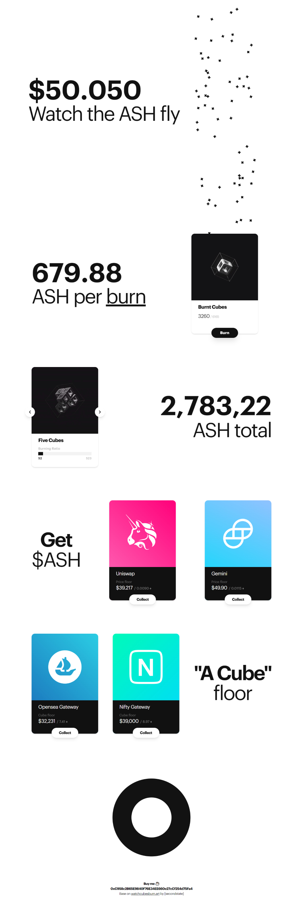

<p align="center">
    
</p>

#### 🙌 HUGE credit to *[secondstate]* for his/her work on *[watchcubesburn.art](https://watchcubesburn.art/)*.
 

# Live

### 🔗 ***[watchashfly.tina.cafe](https://watchashfly.tina.cafe/)***
Served using *[Yeetify 💨](https://github.com/tinawng/yeetify)*


# Intro
I was really inspired by *[secondstate]*'s *[watchcubesburn.art](https://watchcubesburn.art/)* website and decide to give it a try!

This is just an excercice for me, I got no intention to sell or promote things (other than my incredible skill 😜).


# Stack

### Nuxt.js
- ⚡️ Static website generation
### Tailwind
- 💄 Responsive design
- 🎨 PurgeCSS

# Links

- 🏗️ Nuxt.js: *[https://nuxtjs.org](https://nuxtjs.org/)*
- ✨ Vue.js: *[https://vuejs.org](https://vuejs.org/)*
- 💄 Tailwind CSS: *[https://tailwindcss.com](https://tailwindcss.com/)*

# Build Process

```bash
# install dependencies
$ yarn install

# dev server with hot reload
$ yarn run dev

# build for production
$ yarn run generate
```